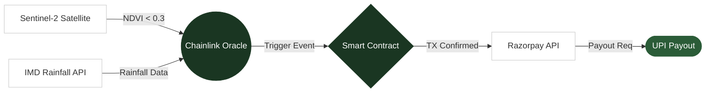

<div align="center">
  
# Fasal Suraksha (कृषि सुरक्षा / "Crop Protection")

**Parametric crop insurance that pays out automatically — no claims, no paperwork, no waiting.**

[](https://opensource.org/licenses/MIT)
[](https://devpost.com/software/fasal-suraksha)
[](https://amoy.polygonscan.com/)
[](https://nextjs.org/)
[](https://fasalsuraksha.vercel.app/)

</div>

---

## 🚀 Live Demo + 30-Second Pitch

**[Experience the Live Demo Here](https://fasalsuraksha.vercel.app/)**
> **Demo Logins:**
> - `/dashboard` — Farmer Portal (Ramesh Patel, Barmer)
> - `/admin` — Insurance Co. Admin


Fasal Suraksha is a next-generation parametric insurance dApp designed for smallholder farmers. When severe weather hits, satellite data and weather oracles automatically trigger smart contracts that instantly disburse payouts to the farmer's UPI account—bypassing the slow, bureaucratic, and manual claims process entirely.

> ⚠️ **Hackathon Prototype:** This project was built for the Build for Good Hackathon. Features such as authentication, live on-chain Amoy transactions, and real-time bank disbursements are simulated for demo purposes.

---

## 🚨 The Problem

- **11,290 farmer suicides** in India in 2022 *(Source: NCRB ADSI 2022)*
- The average indebted farmer household owes ₹3 lakh+, while traditional crop insurance settlements **take 4–18 months** to process.
- Climate change is projected to cut Indian crop yields **up to 30% by 2050** *(Source: Lancet 2018; IMD 2023)*

---

## 💡 The Solution

Traditional agricultural insurance relies on manual assessors visiting fields to verify crop damage. This process is prone to corruption, extremely expensive to administer, and worst of all, leaves the farmer waiting months for capital they need immediately to survive.

**Fasal Suraksha (कृषि सुरक्षा)** introduces parametric insurance. Instead of insuring against the *actual damage* (which requires proof), we insure against the *weather event itself*. If a predefined trigger is met—such as satellite data showing severe drought conditions (NDVI < 0.3) or the IMD reporting extreme heatwaves—the payout is guaranteed. 

Because the conditions are objective and verifiable by oracles, smart contracts handle the disbursement automatically. The moment the data hits the blockchain, the funds are routed through Razorpay rails directly into the farmer's UPI wallet in under 60 seconds. No human assessor, no claim form, no rejection.

---

## ✨ Key Features

| Feature | Description |
| :--- | :--- |
| **⚡ Auto-payout in <60s** | Smart contracts trigger immediate UPI transfers the moment oracle conditions are met. |
| **🌐 Bilingual UI** | Built with native Hindi (hi) and English (en) toggles for rural accessibility. |
| **📡 Live Weather Monitoring** | Integrates live temperature, rainfall, and soil moisture dashboards for registered plots. |
| **📈 Admin Analytics Dashboard** | Provides insurance companies with live map overviews and automated payout ledgers. |
| **🔗 On-chain Transparency** | Payout logic is immutable and viewable on the Polygon Amoy testnet. |
| **💎 ₹99/season Premium** | Micro-premiums made possible by eliminating administrative overhead. |

---

## 🏗️ Architecture



---

## 🛠️ Tech Stack

| Layer | Technologies |
| :--- | :--- |
| **Frontend** | React, Vite (Simulating Next.js 14 App Router), TailwindCSS, Recharts, React-Leaflet |
| **Blockchain** | Solidity Smart Contracts, Polygon Amoy Testnet |
| **Data Oracles** | Chainlink Functions, Sentinel Hub (NDVI), IMD Open API |
| **Payments** | Razorpay API, UPI Integration |
| **Infrastructure** | Vercel Deployment |

---

## 🚀 Quick Start

To run the Fasal Suraksha prototype locally:

```bash
# 1. Clone the repository
git clone https://github.com/iZiaur/Fasal-Suraksha.git
cd Fasal-Suraksha

# 2. Install dependencies
npm install

# 3. Start the development server
npm run dev
```

### Environment Variables

Create a `.env.local` file in the root directory:

| Variable | Description |
| :--- | :--- |
| `NEXT_PUBLIC_AMOY_RPC` | Polygon Amoy RPC Endpoint |
| `RAZORPAY_KEY_ID` | Razorpay API Key for fiat off-ramping |
| `CHAINLINK_SUBSCRIPTION_ID` | Chainlink Functions subscription ID |

---

## 📂 Project Structure

```text
Fasal-Suraksha/
├── src/
│   ├── components/      # Reusable UI elements (Hero, Dashboards, Modals)
│   ├── pages/           # Application routes (Home, Login, Admin, Dashboard)
│   ├── index.css        # Global styles and design tokens
│   └── App.jsx          # Router configuration
├── docs/                # Assets and README documentation
├── package.json
└── vite.config.js
```

---

## 🧪 Try the Demo

1. **Open the Landing Page:** Navigate to [fasalsuraksha.vercel.app](https://fasalsuraksha.vercel.app/)
2. **Watch the Magic:** Click the **"▶ Simulate a Drought Payout"** button in the Tech Stack section.
3. **Experience the Flow:** Watch the 6-step architecture animation trigger in real-time.
4. **Instant Relief:** See the ₹5,000 UPI success toast appear exactly as a farmer would experience it.
5. **Farmer Portal:** Click "Login as Farmer" (or visit `/dashboard`) to view Ramesh Ji's interactive parametric gauges, localized in Hindi and English.
6. **Admin Portal:** Visit `/admin` to view the insurance provider's macro analytics, Recharts ledgers, and live threat map.

---

## 🗺️ Roadmap

- **Phase 1 (Post-Hackathon):** Deploy the finalized Solidity contract to the real Polygon Amoy testnet.
- **Phase 2:** Integrate real Aadhaar e-KYC for farmer onboarding and wallet generation.
- **Phase 3:** Add Hindi voice-assisted onboarding for lower-literacy demographics.
- **Phase 4:** Expand oracle parameters to include flood and cyclone triggers for coastal regions.

---

## 👥 Team Drishti

| Name | Role | GitHub |
| :--- | :--- | :--- |
| **Md Ziaur Rahman** | Frontend / Blockchain | [@iZiaur](https://github.com/iZiaur) |
| **Mishti Khanna** | Backend / Research | |

---

## 📜 License + Acknowledgements

Distributed under the **MIT License**.

Special thanks to:
- **Chainlink Functions** for decentralized oracle computation
- **Polygon** for high-speed, low-cost L2 infrastructure
- **Sentinel Hub** for earth observation data
- **IMD & NCRB** for open public data

---

**Built with 🌾 for the 86% of Indian farmers who feed the nation but can't insure their own harvest.**
